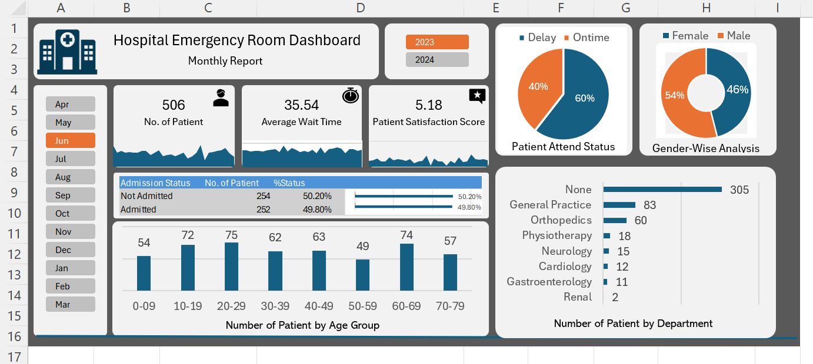
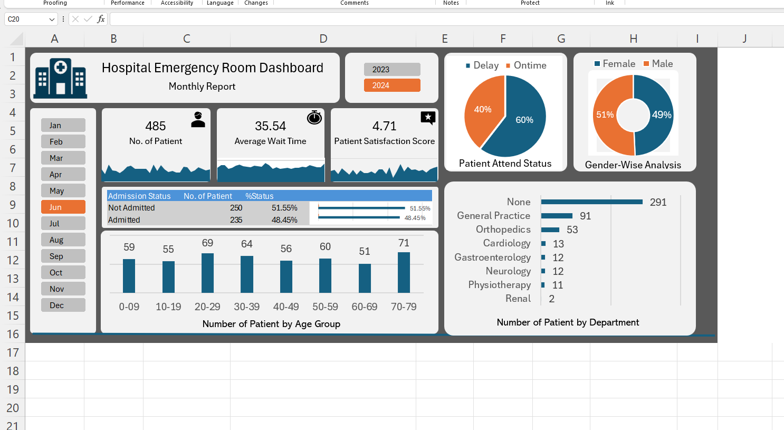

# Hospital Emergency Room Dashboard (Excel)

A full Excel analytics project that models and visualizes Emergency Room (ER) activity across 2023–2024.  
The solution uses **Power Query** for data cleaning and a **Power Pivot** data model (with **DAX**) to power interactive **PivotTables/Charts** and slicers.

---

## 📊 Key Outcomes
- Single-click monthly view of ER performance (2023/2024 toggle + month slicer)
- KPIs:
  - **No. of Patients**
  - **Average Wait Time (mins)**
  - **Patient Satisfaction Score**
- **Admission Status** breakdown (Admitted vs Not Admitted, counts & %)
- **Attend Status** (On-time vs Delayed using a 30-minute threshold)
- **Gender analysis** (Male vs Female)
- **Age-group distribution** (0–9 … 70–79)
- **Patients by Department** (top categories highlighted)

---

## 🧱 Data & Modeling
- **Power Query (ETL):** Cleaned gender values, converted flags to meaningful labels, split admission date/time, created calendar table with `List.Dates`.
- **Data Model (Power Pivot):** Linked calendar table (1) to admission dates (*).  
- **DAX Calculated Columns:**
  - `Age Group` (10-year bins)
  - `Attend Status` (On time vs Delayed using >30 min threshold)

---

## 📈 Visuals

  
  

## 🔍 Key Insight (June 2023 → June 2024)

**Through a like-for-like June comparison, the ER handled more volume while maintaining wait times and improving satisfaction.**  
From the two dashboards:

- **Patient volume:** **485 → 506** (**+21**, ~**+4.3%** YoY).
- **Average wait time:** **~35.5 mins → ~35.5 mins** (essentially unchanged despite higher volume).
- **Patient satisfaction:** **4.71 → 5.18** (**+0.47**), indicating a better patient experience alongside steady throughput.
- **Attend status mix:** **On-time 60% / Delayed 40%** in both years — process stability even with increased demand.
- **Gender mix:** **Female share 51% → 54%** (**+3 pp**), a modest shift worth monitoring for staffing mix and communication needs.
- **Department load:**
  - “**None**”/unclassified front-line cases **291 → 305** (**+14**, ~**+4.8%**).
  - **Orthopedics** **53 → 60** (**+7**, ~**+13%**), suggesting more injury/trauma-type presentations.
  - **General Practice** **91 → 83** (**−8**, ~**−9%**).
- **Age distribution:**
  - **2023:** Peaks at **20–29 (69)** and **70–79 (71)**.
  - **2024:** Peaks at **20–29 (75)** and **60–69 (74)** with **70–79** lower (**57**).
  - **Implication:** demand is bifurcated between **younger adults (acute/trauma)** and **upper-mid seniors (60–69)** rather than the oldest cohort. This shift supports **differentiated resourcing** (e.g., trauma/orthopedics and chronic-care specialties) and **triage tuning** for these two segments.

**Bottom line:** Year-over-year, the ER absorbed higher volume **without longer waits** and with **higher satisfaction**, while case mix shifted toward **Orthopedics** and from **70–79** to **60–69** in age peaks — actionable signals for staffing and specialty coverage.

## 🛠️ Skills & Tools Demonstrated
- **Excel (Advanced):** PivotTables/Charts, slicers, KPI cards, dashboard layout
- **Power Query (M):** Data cleaning, `Replace Values`, `List.Dates` calendar build
- **Power Pivot (Modeling):** Relationships (1:*), marked date table
- **DAX:** Conditional bucketing (`SWITCH(TRUE())`), wait-time rule classification
- **Data Visualization:** Executive dashboard design, KPI storytelling
